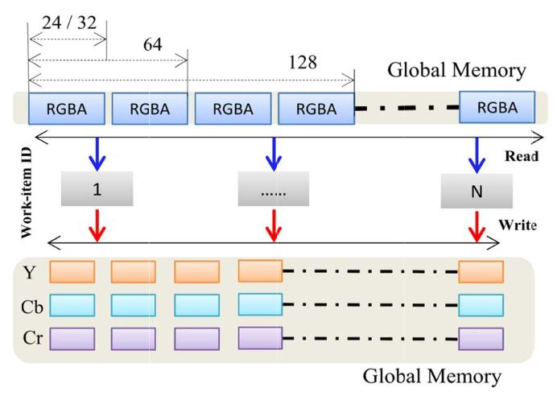
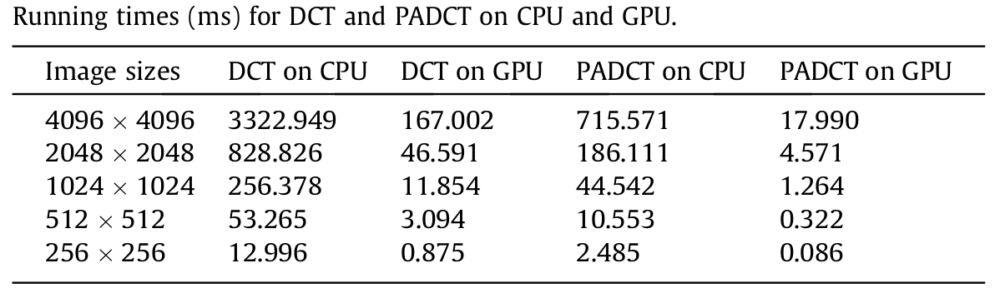
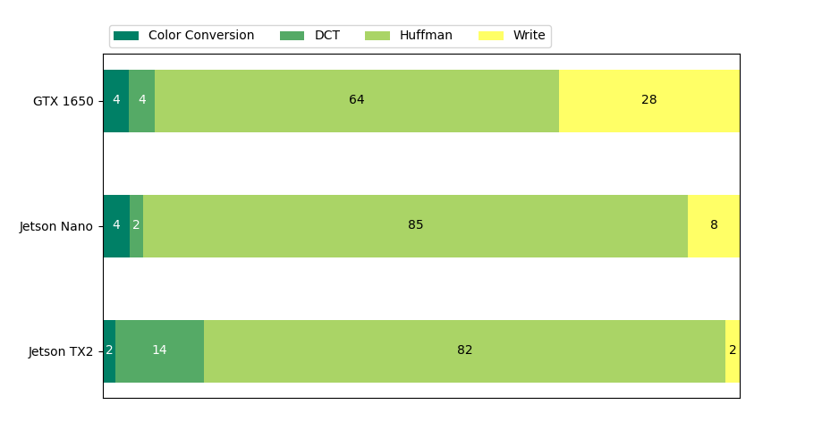

# Introduction

The following document describes the activities carried out to analyze algorithms, libraries, and platforms to accelerate JPEG compression on GPUs. This study considered both commercial and open-source libraries with a free (Custom BSD-like) license.

The platforms used in the study were:

* Nvidia Jetson TX2
* Palit Nvidia GeForce GTX 1650

Further tests were conducted on the Nvidia Jetson Nano.

Two development platforms were used in this study, one for Linux environment development and one for Windows environment development. For the Linux development platform, a server with an AMD EPYC 7301 16-Core 2.7 GHz processor and an Nvidia Tesla T4 GPU was used. The CUDA Toolkit 10.2 libraries were pre-installed on this platform. This platform was used solely for developing the benchmark program code; the JPEG compression execution time was not included in this analysis.

For the Windows 10 environment development platform, a tower PC with an Intel i5 processor and a Palit Nvidia GeForce GTX 1650 video card was used. The GPU drivers and CUDA Toolkit 10.2 libraries were installed on this platform.

To measure the performance of the libraries and GPUs, benchmark software executable on both Linux and Windows was developed. The analysis of the metrics considered in the benchmark and a comparative study of the library executions contributed to defining certain elements of the reference architecture reported in the "Reference Architecture and development plan" document.

As an addition to the analysis of the libraries representing the state of the art for commercial applications, a series of articles in the literature were reviewed. The feasibility of the proposed implementations was analyzed based on development complexity and actual performance improvement.

The rest of the document is organized as follows: In "Project Requirements," the functional and non-functional requirements are presented. In "Software Libraries and Hardware Platforms," the libraries and platforms used in this project are described in detail, with particular attention to the different architectural characteristics of the GPUs and the effect these differences have on final performance. In "Benchmark," the description of the benchmark program, the analyzed metrics, and the results obtained on the various platforms, with relative interpretation and discussion, are presented. In "Articles and Publications," significant articles describing techniques and algorithms aimed at improving JPEG compression performance on GPUs are reviewed. Finally, in "Conclusions," the observed characteristics of the examined libraries and platforms are summarized, and possible implementation solutions to be included in the reference architecture, along with their implementation difficulties, are reported.

# The JPEG Compression

The JPEG standard described in [1] defines an image compression algorithm based on the Discrete Cosine Transform (DCT) and Entropy encoding. The standard neither defines nor requires a specific colorspace, does not specify or encode pixel aspect ratio information, and does not include image acquisition characteristics. The definition of these elements is reported in the document describing the JPEG File Interchange Format (JFIF) [2], which represents the standard file format for JPEG-compressed images.

In [1], four Modes of Operation for JPEG encoding are proposed:

* **Sequential Encoding:** In sequential encoding, each image component (channel) is encoded proceeding from left to right and top to bottom.
* **Progressive Encoding:** In this mode, the image is compressed at incremental definition levels (from a low-definition image to a higher-definition one), and it is useful in cases of long transmission times.
* **Lossless Encoding:** In this mode, the compression is lossless, meaning it is possible to recover the various components of the original image exactly.
* **Hierarchical Encoding:** The image is encoded at different resolutions to allow viewing without first having to decode it to its original size.

For each mode of operation, the JPEG standard defines codecs for 8-bit and 12-bit images.

Among the encodings based on the Discrete Cosine Transform (DCT), JPEG Baseline encoding is the most supported and sufficient for most applications.

The encoding of multi-component images can be considered an extension of the single-component encoding process to each component. The resulting encodings must then be rejoined to form the data stream using interleaving or concatenation methods.

# Forward and Inverse Discrete Cosine Transform

The FDCT (Forward Discrete Cosine Transform) and IDCT (Inverse Discrete Cosine Transform) represent the discrete cosine transform and its inverse transform, and they constitute the operations that allow for significant compression of image size (in bytes) without excessively compromising quality. Similar to the Fourier transform, the DCT allows representing the input signal as a linear combination of components at different frequencies. The assumption that allows achieving high compression levels while avoiding image degradation is that, in natural images, lower frequency components are more present than higher frequency components. This assumption is often correct—think of images with uniform color areas—but when this assumption is violated, distortions become visible in the encoded image. Theoretically, the reconstruction of the original image is possible only for an infinite-precision DCT, but in practice, finite-precision DCTs can also be used to reconstruct the original image without loss of detail. Furthermore, as in the case of the Fourier transform, optimized implementations for various types of systems, such as General Purpose processors, DSPs, FPGAs, and ASICs, have been developed for the DCT.

Before applying the FDCT, the input image is divided into 8x8 sample (pixel) blocks, converted from unsigned integers on P bits (with an input range of [0, 2^(P-1)]) to signed integers on P bits (with a range of [-2^(P-1), 2^(P-1)-1]). Applying the FDCT to an 8x8 sample block results in 8x8 coefficients related to the 2D frequency components. The first of the 64 coefficients is the DC component, while the remaining 63 coefficients are the AC components. The DCT transform allows concentrating most of the input signal information into the low-frequency components, which are located in the upper first part of the 8x8 output matrix, while the higher-frequency components have coefficients close to zero and can therefore be ignored in the encoding without loss of information.

## Quantization

"After the DCT transform, the 64 DCT coefficients are quantized (dequantized) using the quantization table Q. Formally, let Q be the quantization table and F the output of the FDCT, then:

$F_Q(u, v) = floor(\frac{F(u, v)}{Q(u, v)})$

where u and v are frequency coordinates, i.e., each element is divided by its corresponding element.

The quantization phase is the lossy element of JPEG compression, as the function is not invertible.

The JPEG standard specifies that a decoder can store a maximum of four different quantization tables. In a common JPEG file (JFIF file), a pair of tables is associated with the Luma (Y) and Chroma (Cb and Cr) components, respectively, for the DC coefficient and the AC coefficients. In total, in a JFIF file, the four tables present are: Y_DC, Y_AC, CbCr_DC, and CbCr_AC.

In [3], the recommended quantization tables determined experimentally for CCIR-601 images and screens are reported.

After quantization, the DC coefficient of each 8x8 block has the coefficient of the previous block subtracted from it (the first block has the previous DC coefficient equal to zero). This operation is useful to exploit the correlation between adjacent blocks and facilitate entropy coding. The AC coefficients, on the other hand, are ordered according to a "zig-zag" sequence, again to facilitate the subsequent entropy coding phase (see Figure 1). Most implementations use a lookup table to implement this type of ordering.

*Fig 1. Zig-zag ordering for the entropy encoding.*

## Entropy Encoding

The JPEG standard specifies two lossless entropy coding methods: Huffman coding and Arithmetic coding. Huffman coding requires Huffman code tables that must be used both during encoding and decoding. These tables can be predefined tables or specific to the input image. In the latter case, compression is more efficient at the cost of longer execution times related to table construction.

Arithmetic coding does not require tables because it derives statistical measures from the image. It is more complex to implement than Huffman coding and therefore less supported.

The Baseline sequential codec uses Huffman coding with 8-bit input. It is useful to divide entropy coding into two phases: in the first phase, coefficient sequences are converted into an intermediate sequence of symbols; in the second phase, the symbol sequence is converted into a binary data stream of contiguous symbols using the Huffman tables provided as input to the codec.

The Huffman tables, related to the Luma and Chroma components, used for JPEG compression of a multi-channel image are included in the JFIF file.

For multi-channel JPEG images, the data stream can contain interleaved or sequential (non-interleaved) encoding of the components. Some JPEG decoders do not support non-interleaved images unless using Progressive Encoding as the mode of operation.

Two Huffman tables are defined: one for the AC components and one for the DC components. Consequently, two components must share a table. For non-interleaved components, this does not apply because, since the components are separated in the file, after decoding one component, new tables related to the component to be decoded can be loaded.

Color JPEG images can be interleaved or non-interleaved. In an interleaved JPEG, the components are saved in succession, while in a non-interleaved JPEG, the components are saved separately. Some JPEG decoders do not support non-interleaved images unless using progressive encoding (instead of sequential encoding).

The sequential encoding of the coefficients obtained from the FDCT occurs in two phases: in the first phase, the coefficients, ordered according to the zig-zag ordering, are converted into intermediate symbols; in the second phase, the symbols are converted into a data stream using the appropriate Huffman tables.

For the conversion of intermediate symbols into a data stream, it is necessary to provide the Huffman table as input.

In the case of interleaved component images, each of the Ci components is partitioned (divided) into regions of size HixVi data units ordered from left to right, top to bottom. Within each region, the data units are also ordered from left to right and top to bottom. As represented in Figure 2, JPEG defines the term Minimum Coded Unit (MCU) as the smallest group of interleaved data units.

*Fig 2. Ordering examples for different chroma subsampling formats.*

# Project Requirements

The requirements of the JPEG encoder under study were identified in the preliminary phases of this activity and include:

* Portability of the JPEG encoder in Linux and Windows environments.
* Support for JPEG baseline encoding (as specified in ISO/IEC 10918-1) with user-definable quantization and Huffman tables.
* Encoding time less than 3 times the encoding time obtained by the Fastvideo library (formally, encoding\_time < 3 \* fastvideo\_encoding\_time).

The measurement of encoding\_time includes:

* conversion from the input format to YCbCr (4:2:0 and 4:4:4), standard for JFIF files;
* the encoding time of the YCbCr format image into a byte stream.

The transfer\_time is considered as the two-way data transfer time between host memory and device memory. In particular, h2d\_transfer\_time is defined as the latency of a synchronous memcopy from host memory to device memory, and analogously, d2h\_transfer\_time is defined as the latency of a synchronous memcopy from device memory to host memory.

The codec must be able to support the following input formats:

* RGB 24 bit
* BGR 24 bit
* YUV 4:2:2 16 bit
* Grayscale 8 bit
* Grayscale 16 bit

The colorspace used internally in the JFIF file is YCbCr, so a conversion of the input colorspace to YCbCr is provided. The codec supports sampling in 4:2:0 and 4:4:4 formats. Grayscale images are encoded using the Y component and specifying the absence of the other components in the JFIF file, as required by the standard.

In the tests to be carried out in the benchmark, the following must be provided: for the input image, the dimensions, format (colorspace), and resolution; for the encoder, the compression parameter quality factor.

# Software Libraries

The software libraries used in this analysis are divided into libraries that execute the JPEG compression algorithm by leveraging the CPU and libraries that perform compression by delegating execution to the GPU. For the latter, before compression can be performed, it is necessary to copy the input image data from host memory to a pre-allocated area in device memory. At the end of compression, a further transfer from device memory to host memory is required. Despite the latency introduced by the two-way data transfer, the GPU's ability to parallelize instructions allows it to achieve high performance in terms of overall execution time.

The effectiveness of implementing an algorithm on a GPU is linked to the ability to parallelize its operations (thereby reducing the number of serial operations). In the case of JPEG compression, however, some operations are not directly parallelizable and constitute the main causes of performance degradation.

The second source of latency in a GPU implementation is access to device memory. Similar to the cache of a CPU, GPU memory is also organized hierarchically, with some memories accessible with lower latencies than others. The execution mode also changes, particularly in the execution of branching instructions. All these aspects must be taken into consideration to achieve maximum performance.

Most of the efforts made by developers of JPEG compression libraries executable on GPUs are therefore aimed at reducing serial operations and organizing device memory to exploit its access characteristics to reduce read/write latency (memory coalescing).

Below, the CPU and GPU compression libraries used during this activity will be presented. The CPU compression libraries were considered to provide a minimum level with which to compare the GPU-accelerated libraries and to identify the minimum input file sizes that justify the transfer to the GPU.

## Libjpeg (CPU)

This is the standard reference implementation for a JPEG codec, implemented in the C language and distributed as free software with a permissive BSD-like license.

Most image viewing and manipulation programs call the functions present in this library or its variant libjpeg-turbo (imagemagick, gstreamer, ffmpeg, gimp, etc.).

On the Jetson Nano and Jetson TX2 platforms, as part of the L4T Multimedia API Reference, a modified version of libjpeg is present with the TEGRA ACCELERATE extension, which accelerates encoding operations by calling the methods of the NvJpegEncoder class, although it currently only supports YCbCr 420.

## Libjpeg-turbo (CPU)

CPU compression libraries libjpeg and the libjpeg-turbo variant with Single Instruction Multiple Data (SIMD) instructions. Maintains ABI backward compatibility with libjpeg-v6b. Used as the default library by GNU/Linux distributions: Fedora, Debian, Ubuntu, openSUSE, etc.

## Nvidia nvjpeg-10.2 (GPU)

Although presented on the Nvidia website as a JPEG decoding library, nvjpeg supports hybrid CPU/GPU JPEG encoding functions, i.e., with some functions implemented by the GPU and others by the CPU.

The library is part of the CUDA Toolkit from version 10.0, and in this project, the version present in CUDA Toolkit 10.2, compatible with the GTX 1650 installation, was used. It has been observed that on Jetson Nano and Jetson TX2, the nvjpeg version is actually a wrapper for the L4T Multimedia API.

Nvjpeg supports baseline and progressive JPEG encoding, conversion from RGB, BGR, RGBI, BGRI, Grayscale, and YUV, 8-bit and 16-bit quantization tables, and chroma subsampling formats: 4:4:4, 4:2:2, 4:2:0, 4:4:0, 4:1:1, and 4:1:0 for YCbCr components.

It includes various image manipulation functions (translation, zoom, scale, crop, flip, etc.) and functions to manage image batches.

It is possible to control the encoding process using the parameters provided by the API functions, including functions to set a user-definable memory allocator to allocate temporary buffers used during the encoding process.

## Nvidia NPP (GPU)

Nvidia NPP (Nvidia Performance Primitives) is an image, video, and signal processing library with functions optimized for execution on GPUs. It includes colorspace conversion functions, compression functions, and other filtering functions useful for image processing.

Widely used in various applications, it has extensive (although sometimes concise) documentation and good community support. Extremely feature-rich and flexible, it allows for rapid development and analysis of possible solutions before tuning specific sections of the program for which performance is to be increased. Being a library optimized for GPUs, however, it is particularly complex to obtain significant performance increases.

Nvidia NPP was used in this project to implement the various phases of JPEG compression. Unlike nvjpeg, which encapsulates the encoding phases into a single function, NPP allows the encoding process to be divided in order to analyze latencies and identify the main bottlenecks.

## Fastvideo SDK (GPU)

Fastvideo SDK is a commercial library for image and video processing. To test its potential, demo applications for Windows and Linux are provided. The demo applications for Windows are distributed as precompiled and are therefore not modifiable, while the demo applications for Linux are distributed with the source code for the demo application, a Makefile, and the SDK libraries to be linked.

By studying the source code of the demo application, it is noted that Fastvideo allocates temporary buffers and data structures related to the encoder in an initialization phase and deallocates them in a cleanup phase, whose latencies are not considered by the timers that Fastvideo uses to measure the library's performance. Furthermore, as also reported by Fastvideo's developers, the latencies reported in the benchmark do not include the transfer times from host memory to device memory and vice versa.

*Time and performance measurements for Fastvideo SDK modules on NVIDIA GPUs for grayscale
and color images don't take into account host I/O latency (image loading to RAM from HDD/SSD
and saving back). We have presented timings for computations on GPU only. As soon as any image
processing pipeline consists of series of such algorithms (SDK modules), it's a reasonable approach
to measure only computation time, assuming that initial and final images reside in GPU memory.*

Fastvideo implements the JPEG baseline compression standard for 8-bit grayscale images and 24-bit color images. Fastvideo supports standard input formats PGM, YUV, PPM, and BMP. With a modification to the source code of the demo application for Linux that we made for this project, it is also possible to provide raw decompressed data as input and, therefore, support other formats.

Fastvideo supports chroma subsampling formats 4:4:4, 4:2:2, and 4:2:0. It is compatible with ffmpeg and can be integrated with OpenGL.

As reported by Fastvideo, the operations performed by the library during JPEG compression include the operations defined by the JPEG baseline standard: Input data parsing, Color Transform, 2D DCT, Quantization, Zig-zag, AC/DC, DPCM, RLE, Huffman coding, byte stuffing, JFIF formatting. The developers claim to have succeeded in parallelizing all encoding operations, including entropy encoding, which is often implemented serially on CPUs.

The parallel implementation of Huffman coding is not clearly available, so in this activity, we tried to analyze a possible approach to parallelize Huffman coding using the Restart Markers provided by the JPEG standard. We believe that this solution may have compatibility problems with simpler decoders that do not support Restart Markers. In this activity, the tests were carried out using libjpeg as the decoder, which supports Restart Markers, and it was shown that, at least in principle, the use of Restart Markers can be the solution to implement the final bytestream encoding phase in parallel and entirely on the GPU.

The measurements reported by Fastvideo for the JPEG encoding benchmarks concern the execution times of JPEG compression alone on Nvidia GeForce GTX 1080 TI (Nvidia Pascal 3584 Cuda Core), Nvidia Quadro P6000 (Nvidia Pascal 3840 Cuda Core), Jetson Nano, and Jetson TX2. In this activity, we executed the demo applications.

# Hardware Platforms

## Nvidia GeForce GTX 1650

**Architecture:** Turing TU117, 896 core, 14 Streaming Multiprocessors (64 Streaming Processors per SM), Base
Clock 1485 MHz (Boosted Clock 1665 Mhz).

**Memoria:** 4GB GDDR5 8Gbps bus 128bit double slot PCIe, L1 Cache 64 KB (per SM) L2 Cache 1024 KB.

**Performance:**
Pixel Rate 53.28 Gpixel/s, FP16 5.967 TFLOPS, FP32 (float) 2.984 TFLOPS.

**Library Support:**
CUDA 7.5, DirectX 12, OpenGL 4.6, OpenCL 1.2, Vulkan 1.2.131.

**Turing Architecture Description:**
Certo, ecco la traduzione in inglese del testo fornito:

"The Turing architecture is the evolution of the Pascal architecture. It has better performance than Pascal [5], while maintaining code backward compatibility. The major version of the Streaming Multiprocessor (SM) Turing architecture is the same as Volta. In the Turing architecture, each SM includes 4 warp schedulers that manage a static set of warps by assigning instruction execution to specific computing units. Independent instructions are issued at each clock cycle, while two clock cycles are required for the issuance of dependent instructions. Unlike the Pascal architecture, where FMA (Fused Multiply and Add) units complete instruction execution in 6 clock cycles, Turing architecture FMAs require only 4 clock cycles.

In a Turing SM, there are: 64 FP32 (32-bit Floating Point) cores, 2 FP64 cores, 64 INT32 cores, and 8 Tensor Cores. With independent FP32 and INT32 units, simultaneous execution of FP32 and INT32 instructions is therefore possible.

On Turing architectures, a maximum of 32 warps per SM can be executed concurrently, compared to the 64 possible on Volta, and a maximum of 16 thread blocks per SM.

The Turing architecture uses Independent Thread Scheduling, introduced by the Volta architecture, to enable synchronization between warps. This type of scheduling may require code modifications if the code was written making assumptions about warp synchronization valid for hardware architectures prior to Turing. In particular, applications using the \_\_synchthreads() instruction must ensure that all non-exited threads execute the instruction. This and other thread synchronization issues in warps can be identified and corrected by the cuda-memcheck racecheck and synccheck tools.

On the Turing architecture, multiply and accumulate operations on matrices can be performed using dedicated computing units (tensor cores). The CUDA 10 APIs reflect this option, exposing specific load, store, and multiply-accumulate operations for matrices. To use these instructions, a matrix of arbitrary dimensions is divided into submatrices (matrix fragments) of specific dimensions that vary depending on the input data type.

The Turing architecture reintroduces the Unified Shared Memory L1 Texture Cache model already introduced by Volta. Unified Shared Memory combines the functionalities of the L1 cache and Texture cache into a single model that maintains a pre-loaded contiguous memory portion before making it accessible to warp threads. The Unified Shared Memory is 96KB, of which a portion can be dedicated to L1 cache usage (carveout). Turing supports two configurations: 64KB of shared memory and 32KB of L1 cache, or 32KB of shared memory and 64KB of L1 cache. In Turing, a single thread can access the entire 64KB shared memory, but static allocations of up to 48KB are possible to ensure backward compatibility, and a function is introduced to enable dynamic allocation of larger memory areas.

## Jetson TX2 (Chipset Tegra X2)

**Architecture:**
Big.little Dual-core NVIDIA Denver2 e Quad-core ARM Cortex-A57, Pascal 256 core CUDA 6.1.

**Memory:**
8GB LPDDR4 bus 128bit PCIe 2.0, 32GB eMMC flash memory.

**Peripherals:**
HDMI 2.0, 802.11a/b/g/n/ac 2×2 867Mbps WiFi, Bluetooth 4.1, USB3, USB2, 10/100/1000 BASE-
T Ethernet, 12 lanes MIPI CSI 2.0, 2.5 Gb/sec per lane, PCIe 2.0, SATA, SDcard, dual CAN bus,
UART, SPI, I2C, I2S, GPIO.

**Performance**
Pixel Rate 53.28 Gpixel/s, FP16 5.967 TFLOPS, FP32 (float) 2.984 TFLOPS.

**Library Support:**
JetPack 4.2.2, Linux4Tegra R32.2.1 (L4T), CUDA Toolkit 10.0.326, L4T Multimedia API (Argus
0.97), GStreamer 1.14.1, cuDNN 7.5.0, TensorRT 5.1.6, TensorFlow 1.14.0, OpenCV 3.3.1, OpenGL
4.6 / OpenGL ES 3.2.5, Vulkan 1.1.1.

## Jetson Nano (Chipset Tegra X1)

**Architecture:**
Quad-core ARM Cortex-A57, Architettura Maxwell 128-core CUDA 5.3

**Memory:**
4GB LPDDR4, 16GB eMMC

**Performance:**
H.264/H.265 encoder & decoder, Dual ISPs (Image Service Processors).

**Peripherals:**
HDMI 2.0, 802.11ac WiFi, Bluetooth 4.0, USB3, USB2, Gigabit Ethernet, 12 lanes MIPI CSI 2.0, 4
lanes PCIe gen 2.0, SATA, 2x SDcard, 3x UART, 3x SPI, 4x I2C.

**Library Support:**
JetPack 4.2.2, Linux4Tegra R32.2.1 (L4T), CUDA Toolkit 10.0.326, cuDNN 7.5.0, TensorRT 5.1.6,
TensorFlow 1.14.0, VisionWorks 1.6, OpenCV 3.3.1, OpenGL 4.6 / OpenGL ES 3.2.5, Vulkan 1.1.1,
L4T Multimedia API (Argus 0.97), GStreamer 1.14.1.

# Articles and relevant papers

## Accelerating the pre-processing stages of JPEG encoder on a heterogenous system using OpenCL

In [6], the authors describe an implementation of colorspace conversion and chroma subsampling for OpenCL (Open Computing Language) on a hybrid multicore CPU - GPU system. The authors report an 8.78x reduction in execution times compared to a serial CPU implementation.

*Fig 3. Memory layout and work-item mapping for RGBA to YCbCr color space conversion. Different alignments for 32, 64, and 128 bit.*

 The article studies the problem of reducing the latency of RGB to YCbCr colorspace conversion and chroma subsampling from 4:4:4 format to 4:2:0 and 4:2:2 formats. Overall, these pre-processing phases constitute about 40% of the total execution time of a JPEG compression. The authors describe an OpenCL implementation in which memory access is optimized by assigning an appropriate number of pixels to be processed to each thread. In the colorspace conversion phase, each pixel can be processed independently, but instead of assigning a thread to each individual pixel, it is more efficient to process multiple pixels per thread to have aligned memory accesses (see Figure 3). In CUDA, already with the introduction of architectures with CUDA compute capability 2.0, the effect of non-aligned accesses is mitigated by the presence of an L1 cache with 128-bit cache lines. In this type of architecture, sequential accesses are coalesced. The problem of non-optimized memory accesses remains for strided accesses typical of addressing the different rows of the image.

## Parallel program design for JPEG compression encoding

In [7], a software architecture for parallel JPEG encoding for Nvidia CUDA APIs is presented. The authors report a substantial improvement (20-24x) in performance compared to a serial single-core CPU implementation.

The presented algorithm assigns the task of performing colorspace conversion and chroma subsampling to the CPU. The GPU is used for the DCT and quantization of 8x8 blocks, assigning 64 threads (8x8) for each block organized in a CUDA grid of dimensions image_width/8 image_height/8 CUDA blocks. The encoding of the DC and AC components is performed by the CPU. To mask memory transfer latency, while the GPU is busy executing the DCT on the Cb and Cr components, the CPU can begin encoding the DC and AC components. The article suggests some possible optimizations: replacing ordinary operators (+, *, /) with the respective CUDA built-in functions (fadd, fmul, and fdiv); using constant memory for quantization matrices; exploiting memory areas allocated with cudaMallocHost() to ensure the presence of the allocated memory in physical memory (non-relocatable) and ensuring aligned accesses obtainable with cudaMallocPitch() and cudaMemcpy2D().

With the support of the NPP library, the implementation proposed in the article can be extended to include colorspace conversion and Huffman encoding among the operations performed by the GPU.

## A Performance Model of Fast 2D-DCT Parallel JPEG Encoding Using CUDA GPU and SMP-Architecture

In [8], the performance of a JPEG codec implementation on a multiprocessor system (Symmetric Multiprocessor, SMP) and on an NVIDIA GeForce GT430 GPU with 96 CUDA cores are compared. The authors demonstrate that an SMP system has better performance than a GPU implementation, both in terms of core utilization and execution times. The presented compression algorithm exploits the fast DCT implementation also present in libjpeg and Huffman encoding. In the analysis, the authors consider the transfer times to and from the GPU, do not consider an implementation that exploits the GPU's shared memory, and include the initialization times of the CUDA environment. The parallel JPEG implementation presented in the article is applicable to SMP-type parallel architectures that share the same memory, unlike an implementation that exploits the GPU as a co-processor for compression, incurring transfer times on the PCI bus. Multiprocessor architectures can benefit from the parallelism of some JPEG compression phases and lower latencies to and from memory, but they employ computational resources that can be exploited for other tasks.

## Fast approximate DCT with GPU implementation for image compression

In [9], the authors describe a method of approximating the DCT on an 8x8 block that can be implemented with only 17 addition operations. With the proposed approximation, called PADCT (Proposed Approximate DCT), the execution times of the DCT can be reduced without excessively degrading the output image.

The article reports a possible implementation on the GPU that exploits the Nvidia CUDA APIs, analyzed below. The comparative analysis described in the article presents the major differences in terms of latency and output image quality between similar approximation methods derived from the Signed DCT.

The PADCT is formally defined by the transformation

$F = (D_pT_p)X(D_pT_p)^T = D_p(T_pXT_p^T)D_p^T$

where X is the 8x8 input matrix, Tp is a matrix with elements 0, +1, and -1, and Dp is a diagonal matrix used as a normalization coefficient. The matrix F describes a series of sums and differences between only some of the elements of the 8x8 block and constitutes the 17 independent operations of the PADCT.

In the article, the effect of replacing the DCT with the PADCT was analyzed on 256x256 8-bit grayscale images and reported graphically in Figure 4. Since the PADCT is an approximation of the DCT, it can be replaced in a JPEG codec without incurring incorrect decoding. However, the approximation introduces an error that is in some cases not negligible for particular applications. For example, in Figure 4, some artifacts (shoulders and background objects) can be noted, which may be undesirable in particular applications.

*Fig 4. Comparison of different approximation levels of the DCT for a grayscale image 256x256.*

The execution times of the PADCT transform were measured on a CPU (Intel i5-4200M 2.50 GHz) and on a GPU (GeForce GT 720M) with CUDA Toolkit 6 for grayscale images of sizes 256x256, 512x512, 1024x1024, 2048x2048, and 4096x4096. The results are shown in Table 1.

*Tab 1. CPU and GPU excecution times for DCT e PADCT.*

It is noted that replacing the DCT with the PADCT allows reducing execution times by 80% on the CPU and 90% on the GPU.

The GPU implementation proposed in the article involves dividing the input image into 8x8 blocks, which are processed independently by the GPU cores to exploit their parallelism. The 2D transform is performed by 8 threads that apply a 1D transform first along the columns of the matrix and then along the rows (exploiting the associativity of matrix multiplication). As suggested in document [10], to achieve maximum GPU performance, it is advisable to select the number of threads per block as a multiple of the warp size (32 in the case of GeForce 8x architecture); therefore, 32 threads (1 warp) were assigned to each CUDA block. Consequently, each CUDA block (set of threads) is responsible for performing the transform on 4 8x8 matrices of the input image (see Figure 5).

*Fig 5. CUDA thread mapping for a DCT on a 8x8 image block.*

## Comparing CNNs and JPEG for Real-Time Multi-view Streaming in Tele-Immersive Scenarios

We have decided to include this article to present an alternative approach to classic JPEG encoding based on Auto Encoders implemented as Convolutional Neural Networks (CNNs), Recurrent Neural Networks (RNNs), or Generative Adversarial Networks (GANs). An Auto Encoder is trained on a dataset to realize a compression function from a high-dimensional space (an RGB image, for example) to a latent variable space with dimensions much smaller than the input dimensions. The assumption of these models is to consider the input images as vectors in a subspace of the entire space of possible combinations. In particular, it is assumed that images belonging to similar categories (e.g., images of human faces) have common characteristics, and identifying these characteristics (features) allows compressing redundant information and achieving high compression factors.

In [11], the rate-distortion curves and execution times for classic compression algorithms (JPEG and JPEG2000) and compression algorithms based on neural networks are compared. Although the latter perform better in terms of compression factor, they have much longer execution times than classic compression algorithms (10x the JPEG CPU compression execution time). This type of approach is therefore not recommended for low-latency and high-throughput applications. The main advantage of using neural network-based approaches is the possibility of extending them to implement functions not currently supported by classic algorithms, such as multi-scale prediction for adaptive streaming.

# Benchmarks

The benchmark was created based on observations made on the Fastvideo library. In particular, only the encoding time is considered as a comparative metric with Fastvideo, excluding the transfer time from host memory to device memory and vice versa. Memory allocation, initialization, and deallocation times are excluded from the analysis. Similar to the implementation of Fastvideo's test programs, a buffer is allocated to contain the image of the maximum size of the input image set; this buffer will also be used for all other images of equal or smaller sizes. For this activity, the programs npp\_jpgenc and nvjpeg\_jpgenc were developed, which call the functions of the Nvidia NPP and Nvidia NVJPEG libraries, respectively. On Jetson Nano and Jetson TX2, the NVJPEG library, present in the Jetson Multimedia API, has a different interface from the library with the same name available in CUDA Toolkit 10, and the two libraries are not compatible. As per requirements, the npp\_jpgenc program supports the following input image formats:

* RGB 24 bit
* BGR 24 bit
* YUV 4:2:2 16 bit
* Grayscale 8 bit

While nvjpeg\_jpegenc only supports RGB 24 bit and 8-bit Grayscale.

The benchmark programs available as demo applications from Fastvideo were left unchanged.
The execution times of the other formats are instead reported for npp\_jpgenc and nvjpeg\_jpgenc. With npp\_jpgenc, it was also possible to measure the execution times of the various JPEG encoding phases; in particular, the times for YCbCr colorspace conversion, quantized DCT execution, and Huffman encoding were measured. The other libraries do not provide the ability to analyze these encoding algorithm phases in isolation, so the encoding time is reported for these libraries. In the tests performed in the benchmark, the following were specified for the input image: dimensions, format (colorspace), and resolution; the uncompressed and compressed file sizes are also reported; while for the encoder, the compression parameter quality factor is specified. As a further analysis, the effect of the JPEG quality factor on encoding\_time is reported. In order to provide a minimum level of performance, the JPEG encoding execution times on the CPU from the libjpeg library (or the SIMD-accelerated variant libjpeg-turbo) called by the imagemagick program are considered. As an input image, a random image generated by a uniform distribution in the range [0, 255] on the three channels with a defined seed is provided to allow reproducibility of the results, generable by the imgen.py program included in the benchmark tools. It is observed that a random RGB image is characterized by low correlation and can be considered an upper limit to the actual performance of the compression algorithm, which instead assumes a high correlation between spatially close pixels. Figure 6 shows a graph highlighting the different encoding times for a natural (non-synthetic) image and a synthetic image as the JPEG quality factor varies. From the graph, it is noted that the encoding times of the random image are always greater than the encoding times of a non-synthetic image. Therefore, the assumption of considering the compression times of a synthetic image as an upper limit to the encoding times of a non-synthetic image is valid.

*Fig 6. libjpeg-turbo execution times for synthetic random images and non-synthetic images. Synthetic random images have higher execution times due to lower spatial correlation.*

In the graph in Figure 7, the execution times of the encoding process, including the execution time necessary for the YCbCr colorspace conversion of a 5-megapixel random image with 2560x1960 resolution, are reported for the various libraries. From the graph, it is noted that the libraries that exploit the GPU (npp, nvjpeg, and fastvideo) to accelerate the compression process have better performance than libraries implemented for the CPU. The values reported for the libraries implemented for the GPU must, however, be appropriately corrected to also include the time for transferring an image from host to device and the time for transferring the compressed bitstream from device to host.

*Fig 7. Average execution times of JPEG encoding for the analyzed libraries with 5MPixel RGB images at 2560x1960 resolution.*

The transfer time of a 5-megapixel image on a PCI Express v2 bus (500 MB/s per lane) from host to device is ~7.5 ms; while, due to the compression process that produces a smaller bitstream, the transfer time from device to host of the bitstream is lower. To estimate the bitstream size, the models resulting from the analysis of the compression factor trend as the JPEG quality factor varies can be used as a reference. Despite the inclusion of transfer times, JPEG compression on the GPU is still more efficient than CPU compression, even when compared with libraries that exploit SIMD instructions (libjpeg-turbo).

It is observed that the encoding time of Fastvideo on GTX 1650 does not seem to be comparable with the other values reported by Fastvideo's tests on Jetson TX2 and Jetson Nano. Since the benchmark program code is not available, we believe that the value reported in the Fastvideo output should be further evaluated.

*Fig 8. Compression times and compression factor as the JPEG quality factor varies for different input formats.*

Figure 8 shows the graphs relating to the effect of the JPEG quality factor on encoding time and compression ratio (defined as the ratio between the compressed file size and the original file size). From the graphs presented, it can be noted how the encoding time on the GPU varies much less than the serial encoding time on the CPU relative to the JPEG quality factor. Even in the case of GPU compression, there is still a linear relationship with the JPEG quality factor, which is not very visible from the graph in the figure. To highlight the linear relationship, it is possible to isolate the latencies of the various compression phases by running the npp\_jpgenc program. The values derived from running the test program are shown in Figure 9.

*Fig 9. Detail of execution times for the various JPEG encoding phases as the JPEG quality factor varies. The computational cost of Huffman encoding, which represents the non-parallelizable phase of JPEG encoding, is evident.*

As can be seen from the new graph, the execution time of the colorspace conversion, chroma subsampling, and DCT phases is practically constant on the GPU due to the parallelization of operations, while Huffman encoding has an approximately linear dependence on the JPEG quality factor. This dependence relationship derives from the shorter length of Huffman codes (and therefore a smaller number of memory writes) for low JPEG quality factors. In the tests performed with the NPP library, much higher encoding times were noted for the first execution than for subsequent ones. To highlight the warmup phenomenon of the library, 40 compressions were performed for randomly generated RGB images with a uniform distribution in [0, 255] on three channels with different seeds (to exclude the effect of the cache from the analysis).

*Fig 10. NPP encoding times for the analyzed platforms. The high values for the first iteration are due to the loading of dynamic libraries and the initialization of the CUDA environment..*

The values obtained are shown in the graph in Figure 10, where the red line represents the average value of the encoding time excluding the first iteration. The model relating to the compression ratio was used to estimate the output bytestream size to calculate the transfer time from device to host, given the quality factor and input format. The models for the various formats are shown in Table 2.

|           | Compression Ratio |
| --------- | ---------------- |
| RGB       | 2.82e-03 * quality - 6.37e-03 |
| YUV 4:2:2 | 3.87e-03 * quality - 1.58e-03 |
| Mono      | 6.01e-03 * quality + 6.39e-02 |

*Tab 2. Compression models for different input image formats.*

Using the Nvidia NPP library, it was possible to analyze the latencies of the various JPEG compression phases.

*Fig 11. Relative execution times (in percentage) of the various JPEG encoding phases for the analyzed platforms.*

In the graph in Figure 11, the relative latencies (in percentage) with respect to the total execution time of the various compression phases for each analyzed platform are shown. It is noted that most of the latency is due to Huffman encoding, which represents the non-parallelizable section of JPEG encoding. A significant latency value for the DCT on Jetson TX2 is also observed, which could be due to a different implementation of the transform (the 9.0 version of CUDA Toolkit is installed by default on Jetson TX2), or to non-aligned memory accesses.

Table 3 shows the JPEG encoding execution times (in ms) obtained on the platforms analyzed in this activity for random images with different input formats. The jpeg quality factor for the encoder is kept constant at 90%. The execution times relate respectively to the Nvidia NPP, Nvidia NVJPEG, and Fastvideo libraries.

As can be seen from Table 3, Fastvideo has better performance than the other two libraries, as the developers have managed to parallelize the Huffman encoding phase, which is the main bottleneck for the other two libraries. This parallelization is possible thanks to the introduction of Restart Markers provided for progressive codecs and generally used during the decoding phase to support execution recovery during the process in case of error. The use of Restart Markers allows making the DC coefficient encodings independent for a certain number of blocks (definable by the restart interval parameter) and, consequently, parallelizing the encoding and improving execution times. Although libjpeg—and therefore many programs that internally use this library—support JFIF files with Restart Markers, it is not guaranteed that other libraries that implement only baseline codecs can decode these files. For a quantitative measure of the execution time improvement introduced by this optimization, a specific analysis is needed that would involve extending the NPP library to support Restart Markers, which are not currently natively supported.

The values detected in this analysis are much higher than the values reported in document [4] for the Jetson Nano (TX1) and Jetson TX2 platforms. In particular, a x10 difference factor is highlighted, which could be due to the use of random images (with low spatial correlation). In the absence of information on the source of the images used to detect the compression latencies of the Fastvideo benchmark, it is believed that the values reported by Fastvideo are related to non-synthetic images with greater spatial correlation.

In Table 4, we report the encoding execution times (in ms) for natural images from the Kodak dataset [12]. The dataset consists of RGB images with 3072x2048 vertical and horizontal resolution. The JPEG output encoding format is YCbCr 420. As expected, the execution times are lower than the encoding of synthetic random images (approximately 0.7 factor for NPP and NVJPEG and 0.4 for Fastvideo). It is also noted that the margin between the execution times of the NPP and NVJPEG libraries and Fastvideo increases from ~3.4 to ~5.5—Fastvideo for natural images is about 5.5 times faster than NPP and NVJPEG—a behavior explainable by the greater incidence of Huffman encoding and, therefore, a greater relevance of Fastvideo's optimized implementation on execution times.

# Conclusions

In this activity, several possible existing solutions for implementing JPEG encoding on CPU and GPU were analyzed and compared. It was observed that an architecture that includes the GPU in the compression process can reduce execution times, despite the introduction of latencies due to data transmission on the PCI bus. The performance of the NPP, NVJPEG, and Fastvideo libraries, which implement JPEG compression on GPUs for the Nvidia GeForce GTX 1650 platform in Windows 10, Nvidia Jetson Nano, and Nvidia Jetson TX2 in Linux4Tegra, were compared. The analysis shows that Fastvideo is the library with the best performance, but it is a commercial library that is difficult to modify. Conversely, the NPP library has the advantage of being extremely flexible, as it presents an API that isolates the operations necessary for JPEG encoding and allows for free reorganization. For synthetic images, the execution times of the NPP library are close to the specifications requested, while for natural images, Fastvideo is approximately 5.5 times faster than NPP. It is believed that this difference can be explained by the parallel implementation of Huffman encoding by Fastvideo. Quantifying the performance variation by including parallel Huffman coding requires its implementation and is postponed to a subsequent analysis. In the event that this analysis yields positive results, NPP execution times could be further improved by adopting an approach similar to that used by Fastvideo for parallelizing Huffman coding using Restart Markers.

From the data collected in this analysis, the NPP library is identified as the reference implementation.
